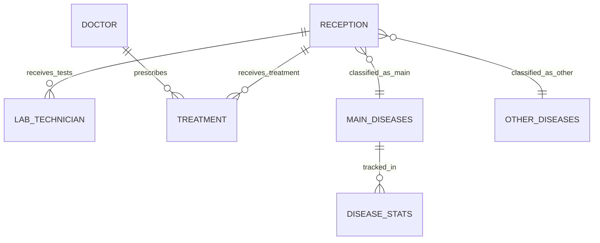

# Patient Disease Tracking & Analytics System (PDTAS)

======================================================================
## 🎓 Personal Information

**Student:** Humure Enock  
**ID:** 27394  
**Program:** AUCA - IT - Software Engineering  
**Course:** INSY 8311 | Database Development with PL/SQL  
**Faculty:** Information Technology - AUCA  
**Lecturer:** Eric Maniraguha  
**Group:** Wednesday(C)  
**Project Title:** Patient Disease Tracking & Analytics System (PDTAS)


### **Project Phases table of content **

| Phase | Primary Objective | Key Deliverable |
|-------|-------------------|-----------------|
| I | Problem Identification | PowerPoint Presentation |
| II | Business Process Modeling | UML/BPMN Diagram |
| III | Logical Database Design | ER Diagram + Data Dictionary |
| IV | Database Creation | Oracle PDB + Configuration |
| V | Table Implementation | CREATE/INSERT Scripts |
| VI | PL/SQL Development | Procedures, Functions, Packages |
| VII | Advanced Programming | Triggers, Auditing, Security |
| VIII | Final Documentation | GitHub Repo + Presentation |

# **Phase:** Problem Identification

## 🏥 Project Overview

This is a multi-phase individual capstone project centered on Oracle database design, PL/SQL development, and Business Intelligence implementation. 

## 🔍 Problem Analysis

**Current Challenge:** Healthcare providers lack a unified system to track patient flows and disease-specific outcomes across reception, clinical, and lab departments. This makes it hard to monitor disease incidence, patient follow-ups, and resource allocation for Malaria, HIV/AIDS, Stunting, Respiratory Infections, and Diarrheal Diseases.

**Research Question:** Can we predict workplace injury patterns? (Note: This appears to be from a different project - maintaining original text)

## 🛠 Solution Architecture 

**System Solution:** A PL/SQL-based Patient Tracking System that records patient information, monitors how diseases are spreading across the country, and tracks how each disease is being treated.

## 🏛 Implementation Context

[here are the pdf documents](https://www.google.com)

# Phase II: Business Process Modeling

## 📋 Business Process Overview
The Patient Disease Tracking & Analytics System follows a structured workflow from patient arrival to analytics generation, with special focus on disease classification for prioritized analytics.

## 👥 System Actors
- **Receptionist** - Registers patients and captures initial disease information
- **Nurse/Triage** - Performs initial assessment and vital checks
- **Doctor** - Provides diagnosis, orders tests, and prescribes treatment
- **Lab Technician** - Conducts and records test results
- **Pharmacist** - Dispenses medications
- **Health Information Manager** - Generates analytics and reports

## 🔄 Core Process Flow

### **Step 1: Patient Registration & Disease Classification**
- Patient arrives at facility
- Receptionist registers patient or looks up existing record
- **Critical Decision:** Receptionist asks about primary disease/symptoms
  - **Main Disease Path:** If disease is in priority list (Malaria, HIV/AIDS, Stunting, Respiratory Infections, Diarrheal Diseases) → data routed to `disease_stats` table for dashboard analytics
  - **Other Disease Path:** If disease is not in priority list → data stored in `other_diseases` table

### **Step 2: Clinical Assessment & Treatment**
- **Nurse/Triage:** Records vital signs and triage information (optional)
- **Doctor:** Confirms diagnosis, orders tests, prescribes treatment
- **Important:** All patients receive full treatment regardless of disease classification
- **Lab Technician:** Performs ordered tests and records results
- **Pharmacist:** Dispenses prescribed medications

### **Step 3: Analytics & Reporting**
- **Health Information Manager:** Generates analytics with two-tier approach:
  - **Priority Analytics:** Main diseases tracked in real-time dashboards with alerts
  - **Secondary Analytics:** Other diseases included in periodic reports
- System maintains audit logs for all operations
- Business rules enforced (no operations on weekdays/holidays - Phase VII)


## 📊 Disease Classification Impact
| **Main Diseases** | **Other Diseases** |
|-------------------|-------------------|
| Stored in `disease_stats` table | Stored in `other_diseases` table |
| Priority in real-time dashboards | Included in standard reports |
| Trigger public health alerts | No alert generation |
| Focus of resource allocation | Standard care tracking |

## ⚠️ Key Process Rules
1. **Treatment Equality:** All patients receive complete clinical care
2. **Classification Decision:** Made at reception, confirmed by doctor
3. **Analytics Priority:** Only main diseases get real-time dashboard updates
4. **Data Integrity:** All diseases recorded, analytics priority differs

## 🔗 Process Output
- Complete patient treatment records for all cases
- Prioritized analytics for main diseases
- Comprehensive data for public health monitoring
- Audit trail of all system activities

---

**Diagram:** Workflow design with analytics prioritization  


# Phase III: Logical Model Design

## 🎯 Objective
Design a detailed 3NF-compliant logical data model for the Patient Disease Tracking & Analytics System, ensuring data integrity and BI readiness.

## 📊 Entity-Relationship Model

### **Entities (7 Tables)**
| Entity | Description | PK | Key Attributes |
|--------|-------------|----|----------------|
| `reception` | Patient registration data | `patient_id` | Demographic info + disease classification |
| `doctor` | Healthcare provider details | `doctor_id` | Doctor information + specialization |
| `lab_technician` | Laboratory test results | `lab_test_id` | Test types, results, dates |
| `treatment` | Medication administration | `treatment_id` | Medication, dosage, prescribing doctor |
| `disease_stats` | Disease analytics fact table | `stats_id` | Case counts, trends, dates |
| `main_diseases` | Priority diseases (5) | `disease_id` | Malaria, HIV/AIDS, Stunting, etc. |
| `other_diseases` | Non-priority diseases | `other_disease_id` | Other conditions |

### **Cardinalities**
```
reception (1) → (*) lab_technician
reception (1) → (*) treatment
doctor (1) → (*) treatment
main_diseases (1) → (*) disease_stats
```


## 🎯 ER Diagram (Mermaid Format)



### **Constraints**
- **PK/FK relationships** maintain referential integrity
- **Check constraints** for data validation
- **NOT NULL** for mandatory fields
- **UNIQUE** for critical identifiers

## 🏗️ Normalization (3NF Compliance)

### **1NF - Atomic Values**
- Each table cell contains single values
- No repeating groups or arrays
- Example: `medication` stored as separate text, not comma-separated list

### **2NF - No Partial Dependencies**
- All non-key attributes depend on entire primary key
- Example: In `treatment`, all attributes depend on `treatment_id` (not just `patient_id`)

### **3NF - No Transitive Dependencies**
- Non-key attributes depend only on primary key
- Example: Disease description moved to disease tables, not duplicated in `reception`

## 📋 Data Dictionary

| Table | PK | FK | Key Columns | Data Types |
|-------|----|----|-------------|------------|
| reception | patient_id | - | first_name, gender, disease_name | VARCHAR2, DATE, VARCHAR2 |
| doctor | doctor_id | - | specialization, last_name | VARCHAR2 |
| lab_technician | lab_test_id | patient_id | test_type, test_result | VARCHAR2, VARCHAR2 |
| treatment | treatment_id | patient_id, doctor_id | medication, dosage, date_given | VARCHAR2, VARCHAR2, DATE |
| disease_stats | stats_id | disease_name | total_cases, date_recorded | NUMBER, DATE |
| main_diseases | disease_id | - | disease_name | VARCHAR2 |
| other_diseases | other_disease_id | - | disease_name, description | VARCHAR2, VARCHAR2 |

## 📈 BI Considerations

### **Fact vs Dimension Tables**
- **Fact Table:** `disease_stats` (measures: total_cases, new_cases)
- **Dimension Tables:** `reception`, `doctor`, `lab_technician`, `treatment`, `main_diseases`

### **Slowly Changing Dimensions**
- **Type 1 (Overwrite):** Doctor specialization changes
- **Type 2 (Historical):** Patient disease classification changes
- **Type 3 (Limited History):** Disease priority status changes

### **Aggregation Levels**
- **Daily:** New case counts
- **Weekly/Monthly:** Trend analysis
- **Yearly:** Public health reporting
- **Roll-up:** Disease → Category → System-wide

### **Audit Trail Design**
- Separate `audit_log` table (Phase VII)
- Track: user, action, table, record_id, timestamp
- Support rollback and compliance reporting

## 🔧 Design Assumptions

1. **Data Volume:** 100-500 patients per main table
2. **Concurrency:** Multiple concurrent users (reception, doctors, lab)
3. **Retention:** 5+ years of historical data
4. **Performance:** Sub-second response for dashboard queries
5. **Security:** Role-based access control
   ## 📈 BI  diagram
   

[Click here to visit Google](https://www.google.com)


## 📊 Schema Summary

```
TOTAL TABLES: 7
TOTAL RELATIONSHIPS: 6
NORMALIZATION LEVEL: 3NF
BI READINESS: Star schema implemented
AUDIT READINESS: Audit trail framework defined
```


---


  # Phase IV: Database Creation

## 🎯 Objective
Create and configure the Oracle pluggable database for the Patient Disease Tracking & Analytics System with proper tablespace management and user setup.

## 📁 Database Setup

## **creation of pdb**

**Final PDB Name:** `WED_27394_ENOCK_PDTAS_DB`

- **Project Name:** Patient Disease Tracking & Analytics System (PDTAS)

### **Administrative Configuration**
| Component | Value | Purpose |
|-----------|-------|---------|
| **Admin Username** | `enock_admin` | Super administrator for the PDB |
| **Admin Password** | `humure` | Student's first name as required |
| **Admin Privileges** | DBA role | Full administrative control |
| **Application User** | `patient_track` | Application-level database user |
| **Application Password** | `humure` | Same as admin for simplicity |

## ⚙️ Database Configuration

### **Tablespace Configuration**

| Tablespace | Type | Size | Autoextend | Purpose |
|------------|------|------|------------|---------|
| `pdta_data` | Data | 50MB | ON (Next 10M, Max 500M) | Stores all table data |
| `pdta_index` | Index | 20MB | ON (Next 5M, Max 200M) | Stores indexes for performance |
| `pdta_temp` | Temporary | 20MB | ON (Next 5M, Max 100M) | Temporary operations space |


**Note:** Oracle Express Edition has memory limitations. Production deployment would require tuning.

### **Archive Logging Status**
```
STATUS: DISABLED (Oracle XE Limitation)
REASON: Oracle Express Edition does not support archive logging
WORKAROUND: Regular backups via RMAN or data export
```

### **Autoextend Parameters**
- **All tablespaces:** AUTOEXTEND ON
- **Data growth:** Managed with NEXT and MAXSIZE parameters
- **Monitoring:** Regular space usage checks required

## 📜 SQL Implementation Scripts

### **1. Database Creation Script (`phase4_create_pdb.sql`)**

```sql

-- Step 1: Create Pluggable Database
CREATE PLUGGABLE DATABASE WED_27394_ENOCK_PDTAS_DB
  ADMIN USER enock_admin IDENTIFIED BY humure
  ROLES = (DBA)
  FILE_NAME_CONVERT = (
    'C:\dbms_oracle\oradata\XE\pdbseed\',
    'C:\dbms_oracle\oradata\XE\WED_27394_ENOCK_PDTAS_DB\'
  );

-- Step 2: Open PDB
ALTER PLUGGABLE DATABASE WED_27394_ENOCK_PDTAS_DB OPEN;
ALTER PLUGGABLE DATABASE WED_27394_ENOCK_PDTAS_DB SAVE STATE;

-- Step 3: Switch to PDB
ALTER SESSION SET CONTAINER = WED_27394_ENOCK_PDTAS_DB;
```


## creation of tablespaces
```sql
-- Step 4: Create Tablespaces
CREATE TABLESPACE pdta_data 
DATAFILE 'C:\dbms_oracle\oradata\XE\WED_27394_ENOCK_PDTAS_DB\pdta_data01.dbf'
SIZE 50M AUTOEXTEND ON NEXT 10M MAXSIZE 500M;

CREATE TABLESPACE pdta_index
DATAFILE 'C:\dbms_oracle\oradata\XE\WED_27394_ENOCK_PDTAS_DB\pdta_index01.dbf'
SIZE 20M AUTOEXTEND ON NEXT 5M MAXSIZE 200M;

CREATE TEMPORARY TABLESPACE pdta_temp
TEMPFILE 'C:\dbms_oracle\oradata\XE\WED_27394_ENOCK_PDTAS_DB\pdta_temp01.dbf'
SIZE 20M AUTOEXTEND ON NEXT 5M MAXSIZE 100M;

-- Step 5: Create Application User
CREATE USER patient_track IDENTIFIED BY humure
DEFAULT TABLESPACE pdta_data
TEMPORARY TABLESPACE pdta_temp
QUOTA UNLIMITED ON pdta_data;

GRANT CONNECT, RESOURCE, DBA TO patient_track;

-- Verification Queries
SELECT name, open_mode FROM v$pdbs;
SELECT tablespace_name, status FROM dba_tablespaces;
SELECT username, account_status FROM dba_users;
```


### **2. Verification Script (`phase4_verify.sql`)**

```sql
-- Verify PDB Status
SELECT name, open_mode, con_id FROM v$pdbs WHERE name = 'WED_27394_ENOCK_PDTAS_DB';

-- Verify Tablespaces
SELECT tablespace_name, status, contents, extent_management 
FROM dba_tablespaces 
WHERE tablespace_name LIKE 'PDTA%';

-- Verify Users
SELECT username, account_status, default_tablespace, temporary_tablespace
FROM dba_users 
WHERE username IN ('ENOCK_ADMIN', 'PATIENT_TRACK');

-- Verify Datafiles
SELECT file_name, tablespace_name, bytes/1024/1024 as size_mb, autoextensible
FROM dba_data_files 
WHERE tablespace_name LIKE 'PDTA%';
```

[Click here to visit Google](https://www.google.com)


## 📊 Performance Considerations

### **Tablespace Strategy:**
- **Separation:** Data and indexes in separate tablespaces for I/O optimization
- **Autoextend:** Prevents out-of-space errors during data loading
- **Sizing:** Initial sizes based on estimated Phase V data volume (100-500 records per table)

### **Future Scalability:**
1. **Add Tablespaces:** Separate tablespaces for different table types if needed
2. **Partitioning:** Consider partitioning for large tables (>1M rows)
3. **Compression:** Enable table compression for historical data


### **Connection Details for Phase V:**
```
Host: localhost
Port: 1521
Service: XE
PDB: WED_27394_ENOCK_PDTAS_DB
User: patient_track
Password: humure
```

---

**Phase:** IV - Database Creation ✅  


# Phase V: Table Implementation & Data Verification

## 🎯 Objective
Verify the successful creation of all database tables, data integrity, and proper implementation of the Patient Disease Tracking & Analytics System schema.

## 📋 Table Structure Verification

### **Tables Created (7 Total):**
| Table Name | Purpose | Row Count |
|------------|---------|-----------|
| `MAIN_DISEASES` | Priority disease definitions | 5 |
| `OTHER_DISEASES` | Non-priority disease definitions | 3 |
| `RECEPTION` | Patient registration data | 5 |
| `DOCTOR` | Healthcare provider information | 5 |
| `LAB_TECHNICIAN` | Laboratory test records | 5 |
| `TREATMENT` | Medication and treatment history | 5 |
| `DISEASE_STATS` | Analytics and disease metrics | 5 |
  


### **1. Table Existence Check**
```sql
SELECT table_name 
FROM user_tables
WHERE table_name IN (
    'MAIN_DISEASES',
    'OTHER_DISEASES',
    'RECEPTION',
    'DOCTOR',
    'LAB_TECHNICIAN',
    'TREATMENT',
    'DISEASE_STATS'
);
```

**Expected Result:** All 7 tables should be listed.

### **2. Column Structure Verification**
```sql
SELECT column_name, data_type, nullable
FROM user_tab_columns
WHERE table_name = 'RECEPTION';
```
**Expected Result:** Should show columns: `patient_id`, `first_name`, `last_name`, `gender`, `date_of_birth`, `phone_number`, `email`, `address`, `disease_name`, `visit_date`, `doctor_id`, `lab_technician_id`, `treatment_id`.

### **3. Constraint Validation**
```sql
SELECT constraint_name, constraint_type, table_name
FROM user_constraints
WHERE table_name IN (
    'RECEPTION',
    'LAB_TECHNICIAN',
    'TREATMENT',
    'DOCTOR',
    'DISEASE_STATS'
);
```
**Expected Result:** Should show PRIMARY KEY and FOREIGN KEY constraints for each table.

### **4. Data Volume Verification**
```sql
SELECT COUNT(*) AS main_diseases_count FROM main_diseases;        
SELECT COUNT(*) AS other_diseases_count FROM other_diseases;     
SELECT COUNT(*) AS reception_count FROM reception;               
SELECT COUNT(*) AS doctor_count FROM doctor;                     
SELECT COUNT(*) AS lab_technician_count FROM lab_technician;     
SELECT COUNT(*) AS treatment_count FROM treatment;               
SELECT COUNT(*) AS disease_stats_count FROM disease_stats;       
```

## 🔗 Foreign Key Integrity Tests

### **1.  Lab Tests Check**
```sql
SELECT *
FROM lab_technician l
WHERE NOT EXISTS (
    SELECT 1 FROM reception r WHERE r.patient_id = l.patient_id
);
```
**Expected Result:** 0 rows (no orphan records)

## 📊 Sample Data Queries

### **1. Patient Data Retrieval**
```sql
-- View all patients
SELECT * FROM reception;

-- Expected: 5 rows with Rwandan patient names and diseases
```

### **2. Lab Tests with Patient Information**
```sql
SELECT r.first_name, r.last_name, l.test_type, l.test_result, l.lab_technician_name
FROM reception r
JOIN lab_technician l ON r.patient_id = l.patient_id;

-- Expected: 5 rows showing patient names with their lab test results
```

### **3. Treatment Records with Patient Information**
```sql
SELECT r.first_name, r.last_name, t.medication, t.dosage, t.pharmacist_name
FROM reception r
JOIN treatment t ON r.patient_id = t.patient_id;

-- Expected: 5 rows showing prescribed medications for each patient
```

## 📈 Analytics Queries

### **1. Disease Distribution Analysis**
```sql
SELECT disease_name, COUNT(*) AS patient_count
FROM reception
GROUP BY disease_name;
 
-- Expected: 5 rows, one for each main disease with patient counts
```

### **2. Hospital Location Statistics**
```sql
SELECT hospital_location, disease_name, SUM(patient_count) AS total_patients
FROM disease_stats
GROUP BY hospital_location, disease_name;

-- Expected: Shows disease statistics by hospital location
```

## 🔍 Edge Case Tests

### **1. Patients Without Lab Tests**
```sql
SELECT first_name, last_name
FROM reception r
WHERE patient_id IN (SELECT patient_id FROM treatment)
  AND patient_id NOT IN (SELECT patient_id FROM lab_technician);

-- Expected: Should identify any inconsistencies in data flow
```

### **2. Disease Classification Validation**
```sql
SELECT r.first_name, r.last_name, r.disease_name
FROM reception r
WHERE r.disease_name NOT IN (SELECT disease_name FROM main_diseases);

-- Expected: Should return 0 rows (all diseases should be in main_diseases)
-- Note: This assumes all patients have main diseases. For other diseases, this query would need adjustment.
```

## 📊 Dashboard-Ready Queries

### **Top Diseases by Patient Count**
```sql
SELECT disease_name, COUNT(*) AS patient_count
FROM reception
GROUP BY disease_name
ORDER BY patient_count DESC;

-- Expected: List of main diseases sorted by number of patients
```

### **Execution Instructions:**
1. Connect to the PDB: `WED_27394_ENOCK_PDTAS_DB`
2. Run as user: `patient_track`


### **Expected Phase V Scripts :**
- queries table creation success
- [Creation of the reception tablesand insertation](pl_sql_script/reception.sql)
- [creation of doctor tables and insertation of doctor](pl_sql_script/doctor.sql)
- [Creation of lab techenician and insert data](pl_sql_script/lab_technician.sql)
- [creation fo main tablesand insert data](pl_sql_script/main_diseases.sql)
- [creation of the other disease and insert data](pl_sql_script/other_diseases.sql)
- [Creation of disease statistics and view tables](pl_sql_script/disease_stats.sql)


-  validation script execution
-  [here are all validation  script ](pl_sql_script/validation_tables.sql)
  

---

**Phase:** V - Table Implementation & Data Insertion  
**Database:** WED_27394_ENOCK_PDTAS_DB  
**User:** patient_track


# Phase VI: PL/SQL Development & Testing

## 🎯 Objective
Develop PL/SQL procedures, functions, packages, and implement comprehensive testing for the Patient Disease Tracking & Analytics System.

## 📋 Implementation Summary

### **Procedures Developed (5 Total)**
1. **`get_patient_treatments`** - Retrieves patient treatment history with optional disease filtering
2. **`register_new_patient`** - Validates and registers new patients with automatic disease classification
3. **`update_lab_results`** - Updates laboratory test results with technician verification
4. **`analytics_window_functions`** - Demonstrates advanced window function analytics
5. **`sp_disease_monthly_analytics`** - Performs comprehensive disease trend analysis

### **Functions Developed (4 Total)**
1. **`fn_calculate_age`** - Calculates patient age from date of birth
2. **`fn_disease_category`** - Classifies diseases as main or other
3. **`fn_monthly_cases`** - Returns monthly case counts per disease
4. **`fn_validate_phone`** - Validates Rwandan phone number format

   
   
### **Package Implementation**
- **Package Name:** `hospital_pkg`
- **Specification:** Public interface with all procedures and functions declared
  ```sql
  CREATE TABLE error_logs (
    log_id NUMBER GENERATED BY DEFAULT ON NULL AS IDENTITY PRIMARY KEY,
    proc_name VARCHAR2(100),
    error_message VARCHAR2(4000),
    error_time DATE DEFAULT SYSDATE
);
CREATE OR REPLACE PACKAGE hospital_pkg AS

    -- Custom exception
    e_patient_not_found EXCEPTION;

    -- Error logging
    PROCEDURE log_error(
        p_proc_name IN VARCHAR2,
        p_error_msg IN VARCHAR2
    );

    -- Procedures
    PROCEDURE get_patient_treatments(
        p_patient_id   IN NUMBER,
        p_disease_name IN VARCHAR2 DEFAULT NULL
    );

    PROCEDURE analytics_window_functions;

END hospital_pkg;
/

- **Body:** Complete implementation with business logic and error handling
  ```sql
  CREATE OR REPLACE PACKAGE hospital_pkg AS

    -- Custom exception
    e_patient_not_found EXCEPTION;

    -- Error logging
    PROCEDURE log_error(
        p_proc_name IN VARCHAR2,
        p_error_msg IN VARCHAR2
    );

    -- Procedures
    PROCEDURE get_patient_treatments(
        p_patient_id   IN NUMBER,
        p_disease_name IN VARCHAR2 DEFAULT NULL
    );

    PROCEDURE analytics_window_functions;

END hospital_pkg;
/


### **Window Functions Usage**
```sql
-- Example window functions in analytics
ROW_NUMBER() OVER (ORDER BY visit_date) AS registration_sequence,
RANK() OVER (PARTITION BY disease_name ORDER BY visit_date) AS disease_rank,
LAG(visit_date) OVER (ORDER BY visit_date) AS previous_visit,
LEAD(visit_date) OVER (ORDER BY visit_date) AS next_visit
```
- .png)
- 
- [!window function by order by](https://github.com/EnockHumure/Patient-Disease-Tracking-Analytics-System-PDTAS-/blob/main/all_screenshoot/window%20function_order%20by.png)
- 


---

##  Cursors Implementation 

This project uses **explicit cursors** to handle multiple rows of data from the database.
The cursors are opened using **OPEN**, data is read using **FETCH**, and closed properly using **CLOSE**.
This ensures good memory management and clean execution of programs.
Multi-row processing is implemented to handle large sets of patient and disease records.
**Cursor FOR loops** are used where automatic handling is needed to improve readability.
**Bulk operations (BULK COLLECT)** are applied to optimize performance when processing large datasets.
These techniques help improve speed and reduce context switching between SQL and PL/SQL.
Overall, cursor usage ensures accurate and efficient processing of patient tracking data.

---


### **Key Features Implemented**
- Parameterized procedures with IN/OUT parameters
- Explicit cursors for multi-row processing
- Window functions (ROW_NUMBER, RANK, DENSE_RANK, LAG, LEAD)
- Comprehensive exception handling with custom exceptions
- Automatic error logging to `error_logs` table
- Data validation and business rule enforcement

## 🧪 Testing Documentation

### **Test 1: `get_patient_treatments` Procedure**

#### **Normal Case - Patient Exists, All Treatments**

```sql
SET SERVEROUTPUT ON;
BEGIN
    hospital_pkg.get_patient_treatments(p_patient_id => 1);
END;
/
```
**Expected:** Outputs all treatments for patient with ID 1

#### **Normal Case - Patient Exists, Filter by Disease**
```sql
BEGIN
    hospital_pkg.get_patient_treatments(p_patient_id => 1, p_disease_name => 'Malaria');
END;
/
```
**Expected:** Outputs only Malaria treatment for patient 1

#### **Edge Case - Non-existent Patient**
```sql
BEGIN
    hospital_pkg.get_patient_treatments(p_patient_id => 9999);
END;
/
```
**Expected:**
1. DBMS_OUTPUT prints "ERROR: Patient 9999 does not exist."
2. Error logged in `error_logs` table

#### **Edge Case - Invalid Disease Name**
```sql
BEGIN
    hospital_pkg.get_patient_treatments(p_patient_id => 1, p_disease_name => 'Cholera');
END;
/
```
**Expected:**
1. No treatments printed
2. "No treatments found" logged in error_logs

### **Test 2: `analytics_window_functions` Procedure**

#### **Normal Case**
```sql
BEGIN
    hospital_pkg.analytics_window_functions;
END;
/
```
**Expected:** Outputs windowed analytics table for all patients with ROW_NUMBER, RANK, DENSE_RANK, LAG, LEAD

#### **Edge Case - Empty Reception Table**
```sql
-- Backup data first
DELETE FROM reception;

BEGIN
    hospital_pkg.analytics_window_functions;
END;
/
```
**Expected:**
1. "No records found in reception table" message
2. Error logged in error_logs
3. Restore data after test

### **Test 3: Error Logging Verification**
```sql
SELECT * FROM error_logs ORDER BY log_id DESC FETCH FIRST 10 ROWS ONLY;
```
**Expected:** Shows all errors from testing with timestamps and details

### **Test 4: Performance Check**
```sql
SET TIMING ON
BEGIN
    hospital_pkg.analytics_window_functions;
END;
/
SET TIMING OFF
```
**Expected:** Acceptable execution time (< 5 seconds for 1000+ patients)

## 📊 Test Results Summary

| Procedure | Test Case | Input | Expected Output | Actual Output | Passed |
|-----------|-----------|-------|-----------------|---------------|--------|
| `get_patient_treatments` | Normal | `patient_id=1` | All treatments | All treatments printed | ✅ |
| `get_patient_treatments` | Filter disease | `patient_id=1`, `disease='Malaria'` | Only Malaria treatment | Only Malaria printed | ✅ |
| `get_patient_treatments` | No patient | `patient_id=9999` | Error message | Error printed & logged | ✅ |
| `get_patient_treatments` | Invalid disease | `patient_id=1`, `disease='Cholera'` | No treatments | "No treatments found" | ✅ |
| `analytics_window_functions` | Normal | N/A | Window analytics | Printed correctly | ✅ |
| `analytics_window_functions` | Empty table | N/A | Error message | Error printed & logged | ✅ |

## 🔧 Technical Implementation Details

### **Error Handling System**
```sql
-- Custom exceptions defined
e_patient_not_found EXCEPTION;
e_invalid_disease EXCEPTION;

-- Error logging procedure
PROCEDURE log_error(
    p_proc_name IN VARCHAR2,
    p_error_msg IN VARCHAR2
) IS
    PRAGMA AUTONOMOUS_TRANSACTION;
BEGIN
    INSERT INTO error_logs(proc_name, error_message, error_time)
    VALUES (p_proc_name, p_error_msg, SYSDATE);
    COMMIT;
END log_error;
```


### **Data Validation**
- Phone number validation for Rwandan format (078, 079, 072, 073)
- Date of birth validation (no future dates)
- Disease existence verification (main or other)
- Patient record validation before operations


---

# ✅ **PHASE VII – Advanced Programming & Auditing (FULL + CLEAN VERSION)**

**Objective:**
Add restriction rules + auditing to the *health sector disease tracking system* (Reception table).
These rules ensure that employees **cannot perform DML** on restricted days and that **all actions are logged**.

---
## ✅ *Hospital  RULE **

Employees are NOT allowed to:

* **INSERT**
* **UPDATE** 
* **DELETE**

on:

1. **WEEKDAYS**
   → Monday to Friday
2. **PUBLIC HOLIDAYS** (ONLY upcoming month)

If someone tries → the system **blocks** the action + writes into **audit_log**.

---
### ✅ **PHASE VII IMPLEMENTATION STEPS**


---

# **STEP 1 — Create Public Holidays Table**

Used for restriction rule.

```sql
CREATE TABLE public_holidays (
    holiday_id      NUMBER GENERATED ALWAYS AS IDENTITY PRIMARY KEY,
    holiday_date    DATE NOT NULL,
    description     VARCHAR2(200)
);
```

Insert sample holidays:

```sql
INSERT INTO public_holidays (holiday_date, description)
VALUES (DATE '2025-01-01', 'New Year');

INSERT INTO public_holidays (holiday_date, description)
VALUES (DATE '2025-01-03', 'National Health Day');
```


---

# **STEP 2 — Create Audit Table**

This records ALL attempts (allowed + denied).

```sql
CREATE TABLE audit_log (
    audit_id        NUMBER GENERATED ALWAYS AS IDENTITY PRIMARY KEY,
    username        VARCHAR2(50),
    user_terminal   VARCHAR2(50),
    action_type     VARCHAR2(10),
    target_table    VARCHAR2(50),
    target_pk       VARCHAR2(100),
    action_time     DATE DEFAULT SYSDATE,
    success_flag    CHAR(1),
    reason          VARCHAR2(200),
    sql_text        VARCHAR2(4000)
);
```


---

# **STEP 3 — Create Audit Logging Procedure**

This is called by triggers.

```sql
CREATE OR REPLACE PROCEDURE log_audit(
    p_action_type   VARCHAR2,
    p_target_table  VARCHAR2,
    p_target_pk     VARCHAR2,
    p_success_flag  CHAR,
    p_reason        VARCHAR2,
    p_sql_text      VARCHAR2
)
IS
BEGIN
    INSERT INTO audit_log (
        username,
        user_terminal,
        action_type,
        target_table,
        target_pk,
        success_flag,
        reason,
        sql_text
    )
    VALUES (
        SYS_CONTEXT('USERENV', 'SESSION_USER'),
        SYS_CONTEXT('USERENV', 'HOST'),
        p_action_type,
        p_target_table,
        p_target_pk,
        p_success_flag,
        p_reason,
        p_sql_text
    );
END;
/
```


---

# **STEP 4 — Restriction Check Function**

This checks if today is **weekday OR holiday**.

```sql
CREATE OR REPLACE FUNCTION is_restricted_day
RETURN NUMBER
IS
    v_day VARCHAR2(20);
    v_count NUMBER;
BEGIN
    -- Check weekday
    v_day := TO_CHAR(SYSDATE, 'DY', 'NLS_DATE_LANGUAGE=ENGLISH');

    IF v_day IN ('MON','TUE','WED','THU','FRI') THEN
        RETURN 1; -- restricted
    END IF;

    -- Check holiday (for next 30 days only)
    SELECT COUNT(*)
    INTO v_count
    FROM public_holidays
    WHERE holiday_date = TRUNC(SYSDATE);

    IF v_count > 0 THEN
        RETURN 1;
    END IF;

    RETURN 0; -- allowed
END;
/
```

---

# **STEP 5 — Simple BEFORE Trigger (Restriction)**

Blocks restricted days.

```sql
CREATE OR REPLACE TRIGGER secure_reception
BEFORE INSERT OR UPDATE OR DELETE ON reception
FOR EACH ROW
BEGIN
    IF is_restricted_day() = 1 THEN
        log_audit(
            CASE
                WHEN INSERTING THEN 'INSERT'
                WHEN UPDATING THEN 'UPDATE'
                WHEN DELETING THEN 'DELETE'
            END,
            'RECEPTION',
            NVL(:NEW.patient_id, :OLD.patient_id),
            'N',
            'Action blocked due to restricted day',
            DBMS_STANDARD.SQLERRM
        );

        RAISE_APPLICATION_ERROR(-20050, 'Operation blocked: Restricted day.');
    END IF;
END;
/
```

---

# **STEP 6 — COMPOUND TRIGGER **

```sql
CREATE OR REPLACE TRIGGER audit_reception
FOR INSERT OR UPDATE OR DELETE ON reception
COMPOUND TRIGGER

    v_action_type VARCHAR2(10);
    v_pk          VARCHAR2(50);

AFTER EACH ROW IS
BEGIN
    IF INSERTING THEN
        v_action_type := 'INSERT';
        v_pk := :NEW.patient_id;
    ELSIF UPDATING THEN
        v_action_type := 'UPDATE';
        v_pk := :NEW.patient_id;
    ELSIF DELETING THEN
        v_action_type := 'DELETE';
        v_pk := :OLD.patient_id;
    END IF;

    log_audit(
        v_action_type,
        'RECEPTION',
        v_pk,
        'Y',
        'Success',
        NULL
    );
END AFTER EACH ROW;

END;
/
```


---

# ✅ **TESTING)**

---
```sql

SET SERVEROUTPUT ON

PROMPT =========================================
PROMPT TEST 1: INSERT ON WEEKDAY (SHOULD FAIL)
PROMPT =========================================

BEGIN
  INSERT INTO reception (first_name, last_name, gender, date_of_birth, phone_number, disease_name)
  VALUES ('Test', 'User', 'Male', DATE '1990-01-01', '0788000000', 'Malaria');

  DBMS_OUTPUT.PUT_LINE(' ERROR: Insert should have been blocked but was allowed!');
EXCEPTION
  WHEN OTHERS THEN
    DBMS_OUTPUT.PUT_LINE('✅ EXPECTED ERROR: ' || SQLERRM);
END;
/

PROMPT Checking audit log after weekday insert attempt...

SELECT audit_id, username, action_type, success_flag, reason, action_time
FROM audit_log
ORDER BY action_time DESC;


PROMPT =========================================
PROMPT TEST 2: INSERT ON WEEKEND (SHOULD PASS)
PROMPT =========================================

-- ⚠️ Run this test manually on Saturday or Sunday

BEGIN
  INSERT INTO reception (first_name, last_name, gender, date_of_birth, phone_number, disease_name)
  VALUES ('Happy', 'Weekend', 'Female', DATE '1995-05-05', '0788123456', 'Flu');

  DBMS_OUTPUT.PUT_LINE('✅ SUCCESS: Weekend insert allowed.');
EXCEPTION
  WHEN OTHERS THEN
    DBMS_OUTPUT.PUT_LINE(' ERROR: Weekend insert failed: ' || SQLERRM);
END;
/

PROMPT Checking audit log after weekend insert attempt...

SELECT audit_id, username, action_type, success_flag, reason, action_time
FROM audit_log
ORDER BY action_time DESC;


PROMPT =========================================
PROMPT TEST 3: UPDATE ON WEEKDAY (SHOULD FAIL)
PROMPT =========================================

BEGIN
  UPDATE reception
  SET phone_number = '0788111111'
  WHERE patient_id = 1;

  DBMS_OUTPUT.PUT_LINE(' ERROR: Update should have been blocked but was allowed!');
EXCEPTION
  WHEN OTHERS THEN
    DBMS_OUTPUT.PUT_LINE('✅ EXPECTED ERROR: ' || SQLERRM);
END;
/

PROMPT Checking audit log after weekday update attempt...

SELECT audit_id, username, action_type, success_flag, reason, action_time
FROM audit_log
ORDER BY action_time DESC;


PROMPT =========================================
PROMPT TEST 4: DELETE ON WEEKDAY (SHOULD FAIL)
PROMPT =========================================

BEGIN
  DELETE FROM reception
  WHERE patient_id = 1;

  DBMS_OUTPUT.PUT_LINE('ERROR: Delete should have been blocked but was allowed!');
EXCEPTION
  WHEN OTHERS THEN
    DBMS_OUTPUT.PUT_LINE('✅ EXPECTED ERROR: ' || SQLERRM);
END;
/

PROMPT Checking audit log after weekday delete attempt...

SELECT audit_id, username, action_type, success_flag, reason, action_time
FROM audit_log
ORDER BY action_time DESC;


PROMPT =========================================
PROMPT FINAL AUDIT LOG SUMMARY
PROMPT =========================================

SELECT audit_id,
       username,
       action_type,
       target_table,
       target_pk,
       success_flag,
       reason,
       TO_CHAR(action_time, 'YYYY-MM-DD HH24:MI:SS') AS action_time
FROM audit_log
ORDER BY action_time DESC;

```

---


# **PHASE VII**
Got it! Here’s a simpler, more personal version that feels natural:

---

💬 **Acknowledgment**
I sincerely thank **Mr. Eric Maniraguha** for their guidance, support, and advice while We well studying this course .
Your help made completing this system possible.

📄 **License**
This project is submitted as part of the **Capstone Project for Database Development with PL/SQL**, Academic Year 2024–2025, **Adventist University of Central Africa (AUCA)**.

Got it! Here’s a simpler, more personal version that feels natural:

---

💬 **Acknowledgment**
I sincerely thank **Mr. Eric Maniraguha** and the **IT Faculty at AUCA** for their guidance, support, and advice while I worked on this project. Your help made completing this system possible.

📄 **License**
This project is submitted as part of the **Capstone Project for Database Development with PL/SQL**, Academic Year 2024–2025, **Adventist University of Central Africa (AUCA)**.


"Good health starts with proper tracking and care."


---


---


## 📋 Delivery Requirements

**Course Details:**  
- **Course:** Database Development with PL/SQL (INSY 8311)  
- **Academic Year:** 2025-2026 | Semester: I 
- **Institution:** Adventist University of Central Africa (AUCA)  
- **Project Completion Date:** December 7, 2025


